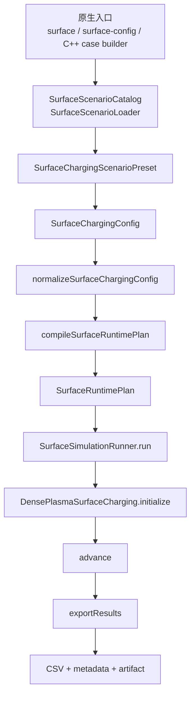

# 原生 Surface 架构总览

## 目的

这份文档不是展开细节，而是给出当前项目 `Surface Charging` 模块的原生使用总览。

它回答的是：

- 从哪里进入
- 核心对象是什么
- 建模与配置如何进入运行时
- 仿真如何启动
- 结果如何输出
- `SPIS import` 在整个系统里处于什么位置

如果你要讲项目整体架构，这份文档应作为入口文档使用。

细节展开请看：

- [native_surface_mainline_workflow.md](./native_surface_mainline_workflow.md)
- [spis_import_compute_workflow.md](./spis_import_compute_workflow.md)

## 一句话结论

当前项目已经具备完整的原生 surface 主链路：

```text
原生 preset / 原生 JSON / 原生 C++ case builder
  -> 场景装载与归一化
  -> 运行时计划编译
  -> DensePlasmaSurfaceCharging 求解
  -> 原生 CSV + metadata + artifact 输出
```

`SPIS import` 只是可选的外部适配与对标链路，不是这个模块成立的前提。

现在仓库也已经补了一份最小可跑 native JSON：

- [scripts/run/surface_config_minimal_example.json](</E:/3-Code/1-Cplusplus/PIC-Surface-Charging-master/scripts/run/surface_config_minimal_example.json:1>)

它对应的是“原生 `surface-config` 入口最小闭环”，适合作为新算例接入起点。

## 1. 顶层分层

从高到低，可以把当前 surface 模块看成 6 层：

1. 入口层  
命令行、preset catalog、JSON loader

2. 场景层  
`SurfaceChargingScenarioPreset`

3. 配置层  
`SurfaceChargingConfig`

4. 编译层  
`normalizeSurfaceChargingConfig(...)`、`compileSurfaceRuntimePlan(...)`

5. 运行层  
`SurfaceSimulationRunner`、`DensePlasmaSurfaceCharging`

6. 输出层  
`exportResults(...)` 生成主 CSV、metadata 与附属 artifact

## 2. 原生主流程图



## 3. 入口层

### 3.1 命令入口

项目已经有原生命令入口：

- `surface`
- `surface-config`

对应代码：

- [main.cpp](</E:/3-Code/1-Cplusplus/PIC-Surface-Charging-master/Main/main.cpp:3329>)
- [main.cpp](</E:/3-Code/1-Cplusplus/PIC-Surface-Charging-master/Main/main.cpp:4046>)

### 3.2 preset 入口

原生 preset 目录层由：

- [SurfaceScenarioCatalog.h](</E:/3-Code/1-Cplusplus/PIC-Surface-Charging-master/Toolkit/Surface%20Charging/include/SurfaceScenarioCatalog.h:15>)
- [SurfaceScenarioCatalog.cpp](</E:/3-Code/1-Cplusplus/PIC-Surface-Charging-master/Toolkit/Surface%20Charging/src/SurfaceScenarioCatalog.cpp:10>)

负责。

### 3.3 JSON 入口

原生 JSON 入口由：

- [SurfaceScenarioLoader.cpp](</E:/3-Code/1-Cplusplus/PIC-Surface-Charging-master/Main/SurfaceScenarioLoader.cpp:252>)

负责把 `base_preset + run + config` 装载成 `SurfaceChargingScenarioPreset`。

## 4. 核心对象

### 4.1 场景对象

原生场景运行对象：

- [SurfaceChargingScenarioPreset](</E:/3-Code/1-Cplusplus/PIC-Surface-Charging-master/Toolkit/Surface%20Charging/include/SurfaceChargingCases.h:17>)

它表达：

- 这是哪个场景
- 用什么配置跑
- 以什么时间步/步数运行
- 默认输出到哪里

### 4.2 核心配置对象

核心配置对象：

- [SurfaceChargingConfig](</E:/3-Code/1-Cplusplus/PIC-Surface-Charging-master/Toolkit/Surface%20Charging/include/DensePlasmaSurfaceCharging.h:413>)

它统一承载：

- 运行策略
- 等离子体/谱
- 材料/发射
- body/patch/interface 结构化建模
- 边界映射
- PIC / MCC / bridge / volume 耦合
- 可选 benchmark / compare / import 信息

## 5. 建模与配置如何进入运行时

### 5.1 结构化建模输入

原生建模不是只写一个面积和材料，而是支持结构化对象：

- `StructureBodyConfig`
- `SurfacePatchConfig`
- `PatchInterfaceConfig`
- `BodyBoundaryGroup`
- `PatchBoundaryGroup`
- `SurfaceBoundaryMapping`

对应定义：

- [DensePlasmaSurfaceCharging.h](</E:/3-Code/1-Cplusplus/PIC-Surface-Charging-master/Toolkit/Surface%20Charging/include/DensePlasmaSurfaceCharging.h:246>)

### 5.2 归一化

这些结构化输入会先被校验并归一化：

- [validateSurfaceChargingConfig(...)](</E:/3-Code/1-Cplusplus/PIC-Surface-Charging-master/Toolkit/Surface%20Charging/include/DensePlasmaSurfaceCharging.h:1071>)
- [normalizeSurfaceChargingConfig(...)](</E:/3-Code/1-Cplusplus/PIC-Surface-Charging-master/Toolkit/Surface%20Charging/src/SurfaceChargingKernelFramework.cpp:5721>)

归一化后，运行时真正消费的是：

- `surface_nodes`
- `surface_branches`
- `patch_physics_overrides`

### 5.3 patch 继承与覆写

patch 级配置不是整包替换，而是：

```text
顶层默认配置
  -> default_surface_physics
  -> patch_physics_overrides
  -> effectivePatchConfig(state)
```

这部分的关键实现：

- [effectivePatchConfig(...)](</E:/3-Code/1-Cplusplus/PIC-Surface-Charging-master/Toolkit/Surface%20Charging/src/SurfaceChargingKernelFramework.cpp:1959>)
- [resolvePatchMaterial(...)](</E:/3-Code/1-Cplusplus/PIC-Surface-Charging-master/Toolkit/Surface%20Charging/src/DensePlasmaSurfaceCharging.cpp:1216>)

## 6. 仿真启动主线

### 6.1 运行器

原生启动主线由：

- [SurfaceSimulationRunner](</E:/3-Code/1-Cplusplus/PIC-Surface-Charging-master/Toolkit/Surface%20Charging/include/SurfaceSimulationRunner.h:21>)

统一执行。

实际运行入口：

- [SurfaceSimulationRunner.cpp](</E:/3-Code/1-Cplusplus/PIC-Surface-Charging-master/Toolkit/Surface%20Charging/src/SurfaceSimulationRunner.cpp:58>)

### 6.2 runtime plan

运行前还会经过编译层：

- [SurfaceRuntimePlan](</E:/3-Code/1-Cplusplus/PIC-Surface-Charging-master/Toolkit/Surface%20Charging/include/SurfaceRuntimePlan.h:18>)
- [compileSurfaceRuntimePlan(...)](</E:/3-Code/1-Cplusplus/PIC-Surface-Charging-master/Toolkit/Surface%20Charging/src/SurfaceRuntimePlan.cpp:103>)

它负责把“编辑态配置”编译成“执行态计划”。

### 6.3 求解主类

最终求解器主类：

- [DensePlasmaSurfaceCharging](</E:/3-Code/1-Cplusplus/PIC-Surface-Charging-master/Toolkit/Surface%20Charging/include/DensePlasmaSurfaceCharging.h:1074>)

核心入口：

- [initialize(...)](</E:/3-Code/1-Cplusplus/PIC-Surface-Charging-master/Toolkit/Surface%20Charging/src/DensePlasmaSurfaceCharging.cpp:4178>)
- [exportResults(...)](</E:/3-Code/1-Cplusplus/PIC-Surface-Charging-master/Toolkit/Surface%20Charging/src/DensePlasmaSurfaceCharging.cpp:11348>)

## 7. 输出层

### 7.1 主结果

主结果不是单一数值列，而是：

- CSV 主序列
- node/source/interface 等扩展主序列
- metadata / sidecar 语义层

### 7.2 附属 artifact

在主结果之外，还会按需导出：

- observer artifact
- shared runtime artifact
- bridge artifact
- volumetric artifact
- benchmark artifact

这些属于诊断、桥接和契约输出，不应与主结果混淆。

## 8. SPIS import 的定位

在当前整体架构中，`SPIS import` 的合理定位是：

- 外部工程适配器
- 参考算例搬运器
- 对标链路的一部分

而不是：

- 主建模入口
- 主配置体系
- 主仿真启动方式
- 主输出体系

更准确地说，系统里是两条并行链路：

### A. 原生主链路

```text
原生建模 / 原生配置 / 原生运行 / 原生输出
```

### B. 外部对标链路

```text
SPIS case / SPIS reference
  -> import / mapping / compare
  -> 对标原生结果
```

## 9. 推荐阅读顺序

如果后面要继续讲项目，建议按这个顺序读：

1. 本文  
先建立整体架构图

2. [native_surface_mainline_workflow.md](./native_surface_mainline_workflow.md)  
再看原生主链路的代码级细节

3. [spis_import_compute_workflow.md](./spis_import_compute_workflow.md)  
最后再看外部 SPIS 适配和对标

4. [native_surface_build_verification_notes.md](./native_surface_build_verification_notes.md)  
如果要复现本次 object-layer 验证与构建恢复过程，再看这份工程注意事项

## 10. 当前状态结论

基于当前代码，可以明确说：

- 项目已经具备原生 surface 入口
- 已经具备原生结构化建模能力
- 已经具备原生配置继承与 patch 覆写机制
- 已经具备统一仿真启动主线
- 已经具备原生主结果与附属 artifact 输出体系
- 已经具备可运行的 object-layer 自动化验证

因此，后续如果你要从“项目自身能力”出发继续推进，应优先围绕这条原生主链路，而不是继续把 `SPIS import` 当成默认叙事中心。

## 11. 当前验证状态

这次已经实际跑通：

- [SurfaceCharging_object_layer_test.cpp](</E:/3-Code/1-Cplusplus/PIC-Surface-Charging-master/Toolkit/Surface%20Charging/test/SurfaceCharging_object_layer_test.cpp:25>)

结果：

- 测试总数 `10`
- 通过数 `10/10`

这组测试已经覆盖：

- `SurfaceScenarioCatalog`
- `SurfaceSimulationRunner`
- `compileSurfaceRuntimePlan(...)`
- `SurfaceTransitionEngine`

所以这份总览文档里的“原生主链路已成立”现在不只是架构判断，也有现有自动化测试证据支撑。
