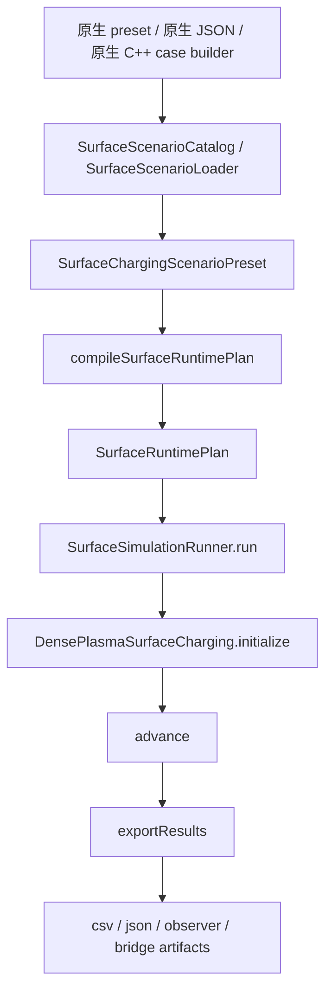

# 原生 Surface 主链路梳理

## 目的

这份文档只回答一个问题：当前项目自身是否已经具备 `原生建模入口`、`属性配置结构`、`仿真启动主线` 与 `结果输出链路`。

结论是：**具备，而且已经形成了独立于 SPIS import 的对象层和命令层主线。**

这里的 `Child_Langmuir`、`Plasma_Wake`、`SPIS import` 都只能算辅助验证或外部适配，不应被理解为项目的唯一使用方式。

## 总体结论

当前 surface 模块已经形成了下面这条原生主链路：

```text
原生 preset / 原生 JSON 配置
  -> SurfaceScenarioCatalog / SurfaceScenarioLoader
  -> SurfaceChargingScenarioPreset
  -> compileSurfaceRuntimePlan()
  -> DensePlasmaSurfaceCharging::initialize()
  -> advance()
  -> exportResults()
```

对应代码证据：

- CLI 入口：[Main/main.cpp](</E:/3-Code/1-Cplusplus/PIC-Surface-Charging-master/Main/main.cpp:3420>)
- JSON 场景装载：[Main/SurfaceScenarioLoader.cpp](</E:/3-Code/1-Cplusplus/PIC-Surface-Charging-master/Main/SurfaceScenarioLoader.cpp:252>)
- 原生 preset catalog：[SurfaceScenarioCatalog.h](</E:/3-Code/1-Cplusplus/PIC-Surface-Charging-master/Toolkit/Surface%20Charging/include/SurfaceScenarioCatalog.h:15>)、[SurfaceScenarioCatalog.cpp](</E:/3-Code/1-Cplusplus/PIC-Surface-Charging-master/Toolkit/Surface%20Charging/src/SurfaceScenarioCatalog.cpp:10>)
- 场景 preset 结构：[SurfaceChargingCases.h](</E:/3-Code/1-Cplusplus/PIC-Surface-Charging-master/Toolkit/Surface%20Charging/include/SurfaceChargingCases.h:17>)
- 核心配置结构：[DensePlasmaSurfaceCharging.h](</E:/3-Code/1-Cplusplus/PIC-Surface-Charging-master/Toolkit/Surface%20Charging/include/DensePlasmaSurfaceCharging.h:413>)
- runtime 编译层：[SurfaceRuntimePlan.h](</E:/3-Code/1-Cplusplus/PIC-Surface-Charging-master/Toolkit/Surface%20Charging/include/SurfaceRuntimePlan.h:18>)、[SurfaceRuntimePlan.cpp](</E:/3-Code/1-Cplusplus/PIC-Surface-Charging-master/Toolkit/Surface%20Charging/src/SurfaceRuntimePlan.cpp:103>)
- 统一运行器：[SurfaceSimulationRunner.cpp](</E:/3-Code/1-Cplusplus/PIC-Surface-Charging-master/Toolkit/Surface%20Charging/src/SurfaceSimulationRunner.cpp:58>)
- 求解与导出：[DensePlasmaSurfaceCharging.cpp](</E:/3-Code/1-Cplusplus/PIC-Surface-Charging-master/Toolkit/Surface%20Charging/src/DensePlasmaSurfaceCharging.cpp:4183>)、[DensePlasmaSurfaceCharging.cpp](</E:/3-Code/1-Cplusplus/PIC-Surface-Charging-master/Toolkit/Surface%20Charging/src/DensePlasmaSurfaceCharging.cpp:11348>)

## 1. 原生建模入口

### 1.1 命令行原生入口

`surface` 和 `surface-config` 已经是 surface 模块的正式入口命令。

- 用法打印：[main.cpp](</E:/3-Code/1-Cplusplus/PIC-Surface-Charging-master/Main/main.cpp:3317>)
- `surface-config <config_json> [output_csv]` 命令分发：[main.cpp](</E:/3-Code/1-Cplusplus/PIC-Surface-Charging-master/Main/main.cpp:4046>)
- 实际运行入口 `runSurface(...)`：[main.cpp](</E:/3-Code/1-Cplusplus/PIC-Surface-Charging-master/Main/main.cpp:3420>)

这说明项目并不依赖 SPIS import 才能启动 surface 计算；它本身就有原生命令入口。

### 1.2 原生 preset 入口

如果用户直接跑 preset，入口会经过 `SurfaceScenarioCatalog`：

- 接口定义：[SurfaceScenarioCatalog.h](</E:/3-Code/1-Cplusplus/PIC-Surface-Charging-master/Toolkit/Surface%20Charging/include/SurfaceScenarioCatalog.h:15>)
- 实现转发到原生 case 集合：[SurfaceScenarioCatalog.cpp](</E:/3-Code/1-Cplusplus/PIC-Surface-Charging-master/Toolkit/Surface%20Charging/src/SurfaceScenarioCatalog.cpp:10>)

它提供了：

- `listMainlinePresetNames()`
- `listReplayPresetNames()`
- `tryGetMainlinePreset()`
- `tryGetReplayPreset()`
- `tryGetPreset()`
- `makeDefaultPreset()`

这代表项目已经有“原生场景目录层”，而不是只能吃外部导入文件。

### 1.3 原生 JSON 配置入口

如果用户直接提供 JSON，则由 `SurfaceScenarioLoader::loadFromJson(...)` 负责装载：

- 定义：[SurfaceScenarioLoader.h](</E:/3-Code/1-Cplusplus/PIC-Surface-Charging-master/Main/SurfaceScenarioLoader.h:12>)
- 实现：[SurfaceScenarioLoader.cpp](</E:/3-Code/1-Cplusplus/PIC-Surface-Charging-master/Main/SurfaceScenarioLoader.cpp:252>)

它会做三件事：

1. 先从 `SurfaceScenarioCatalog` 取默认 preset 或 `base_preset`
2. 再把 JSON 中的 `run` 和 `config` 覆盖到 preset 上
3. 输出一个完整的 `SurfaceChargingScenarioPreset`

也就是说，这里的 JSON 不是“外部导入中间格式”，而是项目自己的原生运行配置入口。

### 1.4 原生示例配置

仓库已经有一个完整原生示例：

- [scripts/run/surface_config_full_example.json](</E:/3-Code/1-Cplusplus/PIC-Surface-Charging-master/scripts/run/surface_config_full_example.json:1>)
- [scripts/run/surface_config_minimal_example.json](</E:/3-Code/1-Cplusplus/PIC-Surface-Charging-master/scripts/run/surface_config_minimal_example.json:1>)

这个样例已经体现出原生建模元素：

- `base_preset`
- `run`
- `config.runtime_route`
- `plasma_model`
- `surface_emission`
- `surface_material`
- `electron_spectrum`
- `ion_spectrum`
- `bodies`
- `patches`
- `interfaces`
- `body_boundary_groups`
- `patch_boundary_groups`
- `boundary_mappings`

因此，“原生建模入口”在代码和样例层都已经存在。

### 1.5 最小可跑原生示例

如果目标是“不依赖 SPIS import，先把 surface 主链路直接跑起来”，仓库现在有一份精简示例：

- [scripts/run/surface_config_minimal_example.json](</E:/3-Code/1-Cplusplus/PIC-Surface-Charging-master/scripts/run/surface_config_minimal_example.json:1>)

它的目标不是展示所有建模字段，而是证明这条原生入口可以最小化地跑通。

它只保留：

- `base_preset`
- `name`
- `output_csv`
- `run.time_step_s`
- `run.steps`
- `run.adaptive_time_stepping`
- 少量 `config` 覆盖

直接运行：

```powershell
cmake --build build --target SCDAT --config Debug
build/bin/SCDAT.exe surface-config scripts/run/surface_config_minimal_example.json
```

默认输出：

```text
results/surface_config_minimal_example.csv
```

这个样例的意义是：

- 它是“原生 `surface-config` 入口”的最小可跑证明
- 它适合作为你自己新算例的起点模板
- 它不依赖 SPIS case 导入

## 2. 属性配置结构

### 2.1 顶层运行对象：`SurfaceChargingScenarioPreset`

原生运行输入不是直接散落字段，而是先落到 `SurfaceChargingScenarioPreset`：

- 定义：[SurfaceChargingCases.h](</E:/3-Code/1-Cplusplus/PIC-Surface-Charging-master/Toolkit/Surface%20Charging/include/SurfaceChargingCases.h:17>)

这个结构负责描述：

- 场景名 `name`
- 场景说明 `description`
- 顶层入口来源 `top_top_entrypoint`
- 核心物理配置 `config`
- 时间步长 `time_step_s`
- 步数 `steps`
- 自适应步进开关和时长
- 默认输出路径 `default_output_csv`

所以 preset 层承担的是“可运行场景实例”的角色。

### 2.2 核心属性对象：`SurfaceChargingConfig`

surface 模块的核心属性对象是 `SurfaceChargingConfig`：

- 定义：[DensePlasmaSurfaceCharging.h](</E:/3-Code/1-Cplusplus/PIC-Surface-Charging-master/Toolkit/Surface%20Charging/include/DensePlasmaSurfaceCharging.h:413>)

这个结构不是一个轻量参数包，而是已经覆盖了完整原生建模需求。按职责可以分成几组：

#### A. 求解与运行策略

- `solver_config`
- `runtime_route`
- `surface_pic_strategy`
- `surface_pic_runtime_kind`
- `surface_instrument_set_kind`
- `benchmark_source`
- `legacy_benchmark_execution_mode`
- `current_algorithm_mode`
- `benchmark_mode`

#### B. 表面充电主体物理参数

- `surface_area_m2`
- `floating`
- `derive_capacitance_from_material`
- `dielectric_thickness_m`
- `sheath_length_m`
- `regime`
- `bulk_flow_velocity_m_per_s`
- `flow_alignment_cosine`
- `electron_flow_coupling`
- `electron_collection_coefficient`
- `ion_collection_coefficient`

#### C. PIC / MCC / circuit 运行控制

- `enable_pic_calibration`
- `enable_live_pic_window`
- `enable_live_pic_mcc`
- `live_pic_window_steps`
- `live_pic_window_layers`
- `live_pic_particles_per_element`
- `use_reference_current_balance`
- `enable_body_patch_circuit`

#### D. 发射与材料

- `material`
- `material_library_path`
- `imported_material_name`
- `emission`
- `reference_see_model`
- `enable_secondary_electron`
- `enable_backscatter`
- `enable_photoelectron`

#### E. 等离子体与谱

- `plasma`
- `distribution_model`
- `electron_spectrum`
- `ion_spectrum`
- `has_electron_spectrum`
- `has_ion_spectrum`

#### F. 原生结构建模

- `bodies`
- `patches`
- `interfaces`
- `body_boundary_groups`
- `patch_boundary_groups`
- `boundary_mappings`

这组字段非常关键。它说明项目已经支持用自己的 body/patch/interface/boundary mapping 体系建模，而不是只能导入 SPIS 几何后再映射。

#### G. 外部桥接与扩展

- `enable_external_field_solver_bridge`
- `enable_external_volume_solver_bridge`
- `external_field_solver_request_path`
- `external_volume_mesh_path`
- `native_volume_boundary_condition_families`
- `native_volume_field_families`

这说明项目还预留了原生外场/体求解桥接能力。

#### H. 可选 SPIS 适配信息

- `spis_import`
- `comparison_targets`
- `spis_reference_output`

这一组存在于核心配置里，但它们应被视为**可选适配与对比层**，不是 surface 主链路成立的前提。

### 2.3 原生 case 构造器

项目已经有原生 case builder，而不是只靠外部 case 转译：

- [SurfaceChargingCases.cpp](</E:/3-Code/1-Cplusplus/PIC-Surface-Charging-master/Toolkit/Surface%20Charging/src/SurfaceChargingCases.cpp:126>)

例如：

- `makeLeoBaseConfig()`
- `makeLeoRamReferenceConfig()`
- `makeLeoWakeReferenceConfig()`
- `makeLeoRamPicCircuitConfig()`
- `makeGeoEcssKaptonReferenceConfig()`

这些函数直接在 C++ 内构造 `SurfaceChargingConfig`，证明项目本身具备“原生建模构造层”。

### 2.4 结构化建模对象如何进入运行时

这部分是当前项目“原生建模入口”最关键的证据。

#### A. 上层结构化建模对象

结构化建模相关类型定义在：

- [DensePlasmaSurfaceCharging.h](</E:/3-Code/1-Cplusplus/PIC-Surface-Charging-master/Toolkit/Surface%20Charging/include/DensePlasmaSurfaceCharging.h:168>)

其中包括：

- `StructureBodyConfig`
- `SurfacePatchConfig`
- `PatchInterfaceConfig`
- `BodyBoundaryGroup`
- `PatchBoundaryGroup`
- `SurfaceBoundaryMapping`

这些对象共同表达的是：

- 结构节点有哪些 `body` / `patch`
- patch 从属于哪个 body
- patch 与 body 或 node 与 node 之间如何通过 `interface` 相连
- 哪些外部边界面属于哪个 boundary group
- 哪个逻辑节点最终映射到哪个 boundary group

#### B. 先做结构化校验

结构化输入会先经过：

- [validateStructuredTopologyConfig(...)](</E:/3-Code/1-Cplusplus/PIC-Surface-Charging-master/Toolkit/Surface%20Charging/src/SurfaceChargingKernelFramework.cpp:184>)

这里明确校验：

- body / patch / interface 的 id 不能重复
- patch 必须引用已存在的 body
- patch 面积必须为正
- boundary group 必须引用存在的 body 或 patch
- `boundary_mappings` 必须引用存在的 node 和 boundary group
- interface 的端点必须存在且不能自连

这说明结构化建模对象不是“随便塞进 config 的松散字段”，而是被当作正式输入契约处理。

#### C. 再归一化为运行时电路拓扑

真正的关键转换在：

- [normalizeSurfaceChargingConfig(...)](</E:/3-Code/1-Cplusplus/PIC-Surface-Charging-master/Toolkit/Surface%20Charging/src/SurfaceChargingKernelFramework.cpp:5721>)
- [normalizeTopologyConfig(...)](</E:/3-Code/1-Cplusplus/PIC-Surface-Charging-master/Toolkit/Surface%20Charging/src/SurfaceChargingKernelFramework.cpp:1723>)

它会把结构化输入编译成运行时拓扑：

- `bodies` -> `surface_nodes`
- `patches` -> `surface_nodes`
- `interfaces` -> `surface_branches`
- `patch` 上的材料/谱/发射局部覆盖 -> `patch_physics_overrides`

这里的命名规则也已经固定：

- `body:<id>`：[bodyNodeName(...)](</E:/3-Code/1-Cplusplus/PIC-Surface-Charging-master/Toolkit/Surface%20Charging/src/SurfaceChargingKernelFramework.cpp:85>)
- `patch:<id>`：[patchNodeName(...)](</E:/3-Code/1-Cplusplus/PIC-Surface-Charging-master/Toolkit/Surface%20Charging/src/SurfaceChargingKernelFramework.cpp:90>)

也就是说，项目内部并不是直接拿 `bodies/patches` 做求解，而是先把它们归一化成统一的电路/节点拓扑层。

#### D. patch-body 与 interface 都会变成 branch

`normalizeTopologyConfig(...)` 中有两类 branch 来源：

1. patch 到所属 body 的默认连接  
当 patch 有 `body_id` 时，会自动生成一条 patch-body branch，用 `patch_body_resistance_ohm` 等参数决定连接。

2. 显式 interface  
`PatchInterfaceConfig` 会直接转成 `SurfaceCircuitBranchConfig`，进入 `surface_branches`。

这说明原生建模不仅表达“有哪些表面对象”，还表达“这些对象怎么电连接”。

#### E. boundary group / mapping 负责把逻辑节点接到求解边界

边界映射相关逻辑在：

- [boundaryGroupIdForNode(...)](</E:/3-Code/1-Cplusplus/PIC-Surface-Charging-master/Toolkit/Surface%20Charging/src/DensePlasmaSurfaceCharging.cpp:4001>)
- [buildSurfaceCircuitMappingState()](</E:/3-Code/1-Cplusplus/PIC-Surface-Charging-master/Toolkit/Surface%20Charging/src/DensePlasmaSurfaceCharging.cpp:6476>)

这里的关系是：

- `body_boundary_groups` / `patch_boundary_groups` 定义边界面集合
- `boundary_mappings` 把 `body:<id>` 或 `patch:<id>` 逻辑节点挂到某个边界组
- 运行时再据此生成 reduced group、投影权重和 artifact 分组

所以 `boundary_mappings` 不是“导出时顺手带的标签”，而是运行时边界归属的一部分。

#### F. 最终由 circuit model 真正消费

归一化后的 `surface_nodes` / `surface_branches` 会被电路模型正式消费：

- [DenseSurfaceCircuitModel::configure(...)](</E:/3-Code/1-Cplusplus/PIC-Surface-Charging-master/Toolkit/Surface%20Charging/src/SurfaceChargingKernelFramework.cpp:5184>)

这里会：

- 遍历 `config.surface_nodes` 创建 circuit node
- 遍历 `config.surface_branches` 创建 circuit branch
- 设置每个 node 的面积、电容、固定电位与元数据
- 设置每条 branch 的导纳/电阻/偏置

这一步非常重要，因为它说明原生建模对象最后确实进入了运行时求解，而不是停留在配置层。

### 2.5 属性配置的分层继承与覆盖

除了“对象怎么进入系统”，另一个关键问题是：材料、等离子体、谱、发射这些属性到底按什么规则生效。

当前代码里已经有一套明确的分层机制。

#### A. 顶层默认配置仍然是 `SurfaceChargingConfig`

顶层默认值仍然来自 `SurfaceChargingConfig` 自身，例如：

- `material`
- `reference_see_model`
- `electron_collection_model`
- `patch_incidence_angle_deg`
- `patch_flow_angle_deg`
- `photoelectron_temperature_ev`
- `patch_photo_current_density_a_per_m2`
- `electron_collection_coefficient`
- `ion_collection_coefficient`
- `plasma`
- `electron_spectrum`
- `ion_spectrum`
- `emission`

也就是说，最基础的一层仍然是“全局 surface 默认配置”。

#### B. 结构化 topology 归一化时，会生成 patch 默认物理层

在 `normalizeTopologyConfig(...)` 里，若存在 patch，会把顶层默认值拷贝到：

- `default_surface_physics`

对应代码：

- [SurfaceChargingKernelFramework.cpp](</E:/3-Code/1-Cplusplus/PIC-Surface-Charging-master/Toolkit/Surface%20Charging/src/SurfaceChargingKernelFramework.cpp:1876>)

这里会把顶层配置同步为 patch 默认物理，包括：

- 默认材料
- 默认 SEE 模型
- 默认电子收集模型
- 默认入射角 / 流向角
- 默认 photoelectron 温度
- 默认 patch 光电流
- 默认电子 / 离子收集系数
- 默认 plasma
- 默认 electron / ion spectrum
- 默认 emission

因此，在“有结构化 patch”的场景下，项目已经显式区分：

- 全局配置层
- patch 默认物理层

#### C. 每个 patch 可以只覆盖自己关心的字段

`SurfacePatchConfig` 不是整包替换，而是基于 `std::optional` 做局部覆盖：

- [DensePlasmaSurfaceCharging.h](</E:/3-Code/1-Cplusplus/PIC-Surface-Charging-master/Toolkit/Surface%20Charging/include/DensePlasmaSurfaceCharging.h:258>)

例如 patch 可以只单独提供：

- `material`
- `plasma`
- `electron_spectrum`
- `ion_spectrum`
- `emission`
- `patch_incidence_angle_deg`
- `electron_collection_coefficient`

其余字段继续继承默认值。

#### D. 归一化后会生成 `patch_physics_overrides`

在 `normalizeTopologyConfig(...)` 中，每个 patch 的可选字段都会被翻译成：

- `SurfacePatchPhysicsConfig`
- `patch_physics_overrides`

对应代码：

- [SurfaceChargingKernelFramework.cpp](</E:/3-Code/1-Cplusplus/PIC-Surface-Charging-master/Toolkit/Surface%20Charging/src/SurfaceChargingKernelFramework.cpp:1767>)

这套 override 采用显式布尔位控制，例如：

- `override_material`
- `override_see_model`
- `override_plasma`
- `override_electron_spectrum`
- `override_ion_spectrum`
- `override_emission`

这意味着 patch 覆写是“逐字段、显式开启”的，而不是隐式替换。

#### E. 运行时按节点解析 patch override

运行时查找覆写配置的入口是：

- [findPatchPhysicsOverride(...)](</E:/3-Code/1-Cplusplus/PIC-Surface-Charging-master/Toolkit/Surface%20Charging/src/SurfaceChargingKernelFramework.cpp:1942>)

它按两种方式匹配：

- `node_index`
- `node_name`

所以 patch 物理配置最终会绑定到具体运行时节点。

#### F. 真正生效时走 `effectivePatchConfig(...)`

最关键的运行时合成逻辑是：

- [effectivePatchConfig(...)](</E:/3-Code/1-Cplusplus/PIC-Surface-Charging-master/Toolkit/Surface%20Charging/src/SurfaceChargingKernelFramework.cpp:1959>)

它的行为可以概括为：

1. 先复制一份 `base_config`
2. 查找当前 patch 节点是否存在 override
3. 只对显式声明了 `override_*` 的字段进行替换
4. 最后把 `surface_area_m2` 调整为当前节点状态的面积

这就是当前项目里 patch 级属性真正生效的统一入口。

#### G. 材料还有一条快速解析路径

材料在 `DensePlasmaSurfaceCharging` 里还有一条更直接的运行时解析路径：

- [resolvePatchMaterial(...)](</E:/3-Code/1-Cplusplus/PIC-Surface-Charging-master/Toolkit/Surface%20Charging/src/DensePlasmaSurfaceCharging.cpp:1216>)

它会：

- 先找 patch override material
- 没有 override 时回落到 `config.material`

这个函数在很多求解与导出位置都会被调用，因此“patch 材料覆盖”已经是运行时一等机制，而不是只在前处理阶段存在。

#### H. 导入材料库时也会同步默认 patch 物理

如果配置启用了材料库导入，材料加载后还会同步：

- `config.material`
- `config.default_surface_physics.material`
- 对应 patch 上按名称匹配的局部材料

对应代码：

- [DensePlasmaSurfaceCharging.cpp](</E:/3-Code/1-Cplusplus/PIC-Surface-Charging-master/Toolkit/Surface%20Charging/src/DensePlasmaSurfaceCharging.cpp:960>)

这说明材料配置并不是“只改一个全局 material 就结束”，而是会同步到 patch 默认物理层。

#### I. 一个更准确的继承顺序

当前项目里，patch 节点的属性生效顺序更准确地说是：

```text
SurfaceChargingConfig 顶层默认
  -> default_surface_physics
  -> patch_physics_overrides
  -> effectivePatchConfig(state)
  -> 运行时模型 / 求解器 / 导出器消费
```

所以文档上不应再把“属性配置结构”理解成一张静态字段表，而应理解成：

- 顶层默认层
- patch 默认层
- patch 局部覆写层
- 节点运行时生效层

## 3. 仿真启动主线

### 3.1 主线入口

surface 运行最终汇聚到：

- [runSurface(...)](</E:/3-Code/1-Cplusplus/PIC-Surface-Charging-master/Main/main.cpp:3420>)

这里并不直接操作 `DensePlasmaSurfaceCharging`，而是通过对象层统一调度：

- `const SurfaceSimulationRunner runner;`
- `runner.run(preset, output_path);`

这说明项目已经把“CLI”和“仿真执行器”解耦。

### 3.2 统一运行器

统一运行器在：

- [SurfaceSimulationRunner.h](</E:/3-Code/1-Cplusplus/PIC-Surface-Charging-master/Toolkit/Surface%20Charging/include/SurfaceSimulationRunner.h:21>)
- [SurfaceSimulationRunner.cpp](</E:/3-Code/1-Cplusplus/PIC-Surface-Charging-master/Toolkit/Surface%20Charging/src/SurfaceSimulationRunner.cpp:58>)

它做的事情是：

1. 创建 `DensePlasmaSurfaceCharging`
2. 调用 `compileSurfaceRuntimePlan(preset)`
3. 调用 `charging.initialize(runtime_plan)`
4. 依据固定步长或自适应步进执行 `advance(...)`
5. 最后调用 `charging.exportResults(output_path)`

因此，`SurfaceSimulationRunner` 就是当前项目中 surface 模块的“仿真启动主线执行器”。

### 3.3 runtime 编译层

`compileSurfaceRuntimePlan(...)` 位于：

- [SurfaceRuntimePlan.h](</E:/3-Code/1-Cplusplus/PIC-Surface-Charging-master/Toolkit/Surface%20Charging/include/SurfaceRuntimePlan.h:18>)
- [SurfaceRuntimePlan.cpp](</E:/3-Code/1-Cplusplus/PIC-Surface-Charging-master/Toolkit/Surface%20Charging/src/SurfaceRuntimePlan.cpp:103>)

`SurfaceRuntimePlan` 的职责不是简单复制 config，而是把“可编辑配置”编译成“可执行计划”：

- `compiled_config`
- `solver_policy_flags`
- `runtime_route`
- `surface_pic_strategy`
- `legacy_input_adapter_kind`
- `surface_pic_runtime_kind`
- `source_name`
- `top_top_entrypoint`
- `scheduled_steps`
- `adaptive_time_stepping`

`buildRuntimePlan(...)` 还会显式执行：

- solver policy 解析
- legacy benchmark 执行配置翻译
- `normalizeSurfaceChargingConfig(config)`
- 谱到 plasma moments 的同步

所以，runtime plan 层已经是一个正式的“原生配置编译层”。

## 4. 求解初始化与结果输出

### 4.1 初始化

求解初始化主入口：

- [DensePlasmaSurfaceCharging::initialize(const SurfaceChargingConfig&)](</E:/3-Code/1-Cplusplus/PIC-Surface-Charging-master/Toolkit/Surface%20Charging/src/DensePlasmaSurfaceCharging.cpp:4178>)
- [DensePlasmaSurfaceCharging::initialize(const SurfaceRuntimePlan&)](</E:/3-Code/1-Cplusplus/PIC-Surface-Charging-master/Toolkit/Surface%20Charging/src/DensePlasmaSurfaceCharging.cpp:4183>)

它会完成：

1. 吸收 runtime plan 的 compiled config 与元数据
2. 应用导入材料或库材料
3. 调用 `validateSurfaceChargingConfig(...)`
4. 构造 `orchestrator_`
5. 由 orchestrator 创建：
   - current model
   - voltage model
   - capacitance model
   - potential reference model
   - electric field provider
   - volume charge provider
   - circuit model
   - field / volume solver adapter
6. 初始化状态量与 history

这说明启动主线不是一个临时脚本式流程，而是完整的对象编排。

### 4.2 结果输出

导出入口：

- [DensePlasmaSurfaceCharging::exportResults(...)](</E:/3-Code/1-Cplusplus/PIC-Surface-Charging-master/Toolkit/Surface%20Charging/src/DensePlasmaSurfaceCharging.cpp:11348>)

这里会把历史量组织成 `Output::ColumnarDataSet`，并导出：

- 时间轴 `time_s`
- 表面势、电荷、电流等主序列
- live PIC / MCC 序列
- body / patch / circuit 序列
- shared-surface runtime 序列
- source-resolved 账本序列
- benchmark / bridge / observer 相关 artifact

所以“结果输出”同样是项目自身主线的一部分，而不是依赖 SPIS compare 后处理才算完成。

### 4.3 原生输出体系的分层

这里需要把“主结果”和“附属 artifact”明确分开。

`DensePlasmaSurfaceCharging::exportResults(...)` 的输出逻辑，实际上可以分成四层：

#### A. 主结果 CSV

主结果数据集是 `Output::ColumnarDataSet`，时间轴为：

- `time_s`

主序列直接在 `exportResults(...)` 中写入，例如：

- `surface_potential_v`
- `surface_charge_density_c_per_m2`
- `total_current_density_a_per_m2`
- `electron_current_density_a_per_m2`
- `ion_current_density_a_per_m2`
- `secondary_emission_density_a_per_m2`
- `photo_emission_density_a_per_m2`
- `body_potential_v`
- `patch_potential_v`
- `circuit_branch_current_a`
- `equilibrium_error_v`

对应代码入口：

- [DensePlasmaSurfaceCharging.cpp](</E:/3-Code/1-Cplusplus/PIC-Surface-Charging-master/Toolkit/Surface%20Charging/src/DensePlasmaSurfaceCharging.cpp:11348>)

这部分应当被视为当前项目 surface 模块的**原生主结果**。

#### B. 扩展主序列

除了全局主序列，`exportResults(...)` 还会把更细粒度的运行时结果直接写入同一个主数据集，包括：

1. node 级序列  
例如：

- `surface_node_<n>_potential_v`
- `surface_node_<n>_total_current_density_a_per_m2`
- `surface_node_<n>_effective_sheath_length_m`
- `surface_node_<n>_normal_electric_field_v_per_m`

2. source-resolved 序列  
例如：

- `surface_node_<n>_source_<s>_collected_current_a`
- `surface_node_<n>_source_<s>_interactor_current_a`
- `surface_source_<s>_spacecraft_collected_current_a`
- `surface_source_<s>_spacecraft_interactor_current_a`
- `surface_source_<s>_superparticle_count`

3. interface / branch 级序列  
例如：

- `surface_interface_<i>_current_a`

4. shared runtime / live PIC / volume 耦合序列  
例如：

- `shared_surface_*`
- `live_pic_*`
- `volume_solver_*`
- `field_volume_coupling_*`

这些虽然更细，但依然属于**主结果 CSV 本体的一部分**，不是附属文件。

#### C. metadata / sidecar 层

`exportResults(...)` 还会写入大量 metadata，用来描述结果上下文、运行模式和契约信息，例如：

- runtime / benchmark / route / strategy
- `surface_spis_import_*`
- `surface_source_resolved_*`
- `surface_pic_runtime_*`
- `surface_volume_*`
- `surface_top_top_*`
- `surface_node_*` 和 `surface_interface_*` 描述信息

这些 metadata 的作用是把“结果数值”与“运行语义”绑定起来。

因此在当前项目里，主输出应当理解为：

```text
主 CSV 数值列
  + metadata / sidecar 语义层
```

而不是单纯一张数值表。

#### D. 附属 artifact 层

在主 CSV 之外，`exportResults(...)` 还会按运行能力导出多组 JSON / 报告类 artifact。

这部分不是“主结果本体”，而是**诊断、桥接、观测与契约输出**。

## 5. 原生输出中的 artifact 分类

### 5.1 simulation artifact 与 benchmark case

`exportResults(...)` 一开始就预留了两个主 sidecar：

- `*.simulation_artifact.json`
- `*.benchmark_case.json`

对应位置：

- [DensePlasmaSurfaceCharging.cpp](</E:/3-Code/1-Cplusplus/PIC-Surface-Charging-master/Toolkit/Surface%20Charging/src/DensePlasmaSurfaceCharging.cpp:11358>)

它们的定位更接近：

- 仿真快照/契约说明
- benchmark 对标定义与验证结果

### 5.2 observer artifact

observer artifact 的统一导出接口定义在：

- [SurfaceObserverArtifactExport.h](</E:/3-Code/1-Cplusplus/PIC-Surface-Charging-master/Toolkit/Surface%20Charging/include/SurfaceObserverArtifactExport.h:12>)

对应导出调用：

- [exportSurfaceObserverArtifacts(...)](</E:/3-Code/1-Cplusplus/PIC-Surface-Charging-master/Toolkit/Surface%20Charging/src/DensePlasmaSurfaceCharging.cpp:13526>)

这一层主要承载：

- surface monitor
- shared runtime observer

它们更偏“观测与解释”，不是主结果本体。

### 5.3 shared runtime artifact suite

如果启用了 shared surface runtime，还会导出：

- shared runtime consistency
- shared particle transport domain
- global particle domain
- global particle repository
- global sheath field solve

统一调用：

- [exportSharedRuntimeArtifactSuite(...)](</E:/3-Code/1-Cplusplus/PIC-Surface-Charging-master/Toolkit/Surface%20Charging/src/DensePlasmaSurfaceCharging.cpp:13555>)

这部分属于**共享 runtime 内部机理诊断件**。

### 5.4 bridge artifact suite

如果涉及图耦合、外场桥接或边界映射，还会导出：

- graph report
- graph matrix csv/json
- field adapter report/json
- boundary mapping json
- field request / result template / result
- volume mesh stub
- field bridge manifest
- surface volume projection

统一调用：

- [exportSurfaceBridgeArtifactSuite(...)](</E:/3-Code/1-Cplusplus/PIC-Surface-Charging-master/Toolkit/Surface%20Charging/src/DensePlasmaSurfaceCharging.cpp:13691>)

这部分应被理解为**桥接与诊断工件**，服务于：

- solver bridge
- adapter contract
- graph coupling inspection
- boundary mapping inspection

### 5.5 volumetric artifact suite

如果启用了体求解/外部体桥接，还会导出：

- volumetric adapter artifact
- volume request
- volume result template
- volume result
- volume history

统一调用：

- [exportVolumetricArtifactSuite(...)](</E:/3-Code/1-Cplusplus/PIC-Surface-Charging-master/Toolkit/Surface%20Charging/src/DensePlasmaSurfaceCharging.cpp:13803>)

这部分属于**体求解耦合附属输出**。

### 5.6 benchmark artifact

当运行处于 benchmark / legacy reference 路线时，还会额外生成：

- benchmark metrics
- benchmark consistency
- benchmark acceptance gate
- benchmark reference dataset metadata

这些结果既会进入主 CSV metadata，也会写入专门 benchmark artifact。

因此 benchmark 输出是：

- 一部分进入主数据集 metadata
- 一部分进入独立 benchmark sidecar

## 6. 对“原生输出”的更准确理解

基于当前代码，更准确的输出分层应当是：

```text
第一层：主结果
  CSV 数值列 + metadata / sidecar 语义层

第二层：结构化扩展结果
  node/source/interface/shared-runtime/volume 等细粒度主序列

第三层：附属 artifact
  observer / bridge / volumetric / benchmark / simulation artifact
```

因此后续如果你要定义“项目的正式输出口径”，建议把下面两类明确区分：

- 正式主结果：
  `csv + metadata(sidecar) + 其中的主序列/扩展主序列`

- 附属诊断输出：
  `observer / bridge / runtime / volume / benchmark artifact`

这能避免后面把桥接诊断文件误当成主结果，也能避免把主结果误收缩成只有一张基础 CSV。

## 7. 与 SPIS import 的关系

这部分必须特别澄清。

### 5.1 不应再把 SPIS import 视为主入口

`SPIS import` 的合理定位应该是：

- 外部工程适配器
- 参考算例搬运器
- 对标数据准备器
- source-resolved 对比辅助链路的一部分

它不应该替代以下原生能力：

- 原生建模
- 原生材料与属性配置
- 原生 solver/runtime 装配
- 原生求解推进
- 原生结果导出

### 5.2 更准确的两条链路

当前项目应当理解成并行存在两条链路：

#### A. 原生主链路

```text
原生 preset / 原生 JSON / 原生 C++ case builder
  -> SurfaceScenarioCatalog / SurfaceScenarioLoader
  -> SurfaceSimulationRunner
  -> DensePlasmaSurfaceCharging
  -> 原生 csv/json/artifact 输出
```

#### B. SPIS 辅助链路

```text
SPIS 工程 / SPIS 参考输出
  -> import / mapping / compare / augment
  -> 对标当前项目的原生结果
```

后者服务于对标，不应反客为主。

## 8. 当前代码层验证情况

### 6.1 已确认存在的对象层

已经从代码中确认以下实现都真实存在：

- 原生命令入口：`surface` / `surface-config`
- 原生 preset catalog：`SurfaceScenarioCatalog`
- 原生 JSON loader：`SurfaceScenarioLoader`
- 原生场景对象：`SurfaceChargingScenarioPreset`
- 原生核心配置：`SurfaceChargingConfig`
- 原生 runtime 编译层：`SurfaceRuntimePlan`
- 原生统一运行器：`SurfaceSimulationRunner`
- 原生求解器主类：`DensePlasmaSurfaceCharging`
- 原生结果导出：`DensePlasmaSurfaceCharging::exportResults`

### 8.2 现有测试与验证状态

仓库里已有面向对象层的测试：

- [SurfaceCharging_object_layer_test.cpp](</E:/3-Code/1-Cplusplus/PIC-Surface-Charging-master/Toolkit/Surface%20Charging/test/SurfaceCharging_object_layer_test.cpp:25>)

它已经覆盖了：

- preset catalog 解析
- runner 执行
- runtime plan 编译
- transition engine 行为

我这次已经实际完成了这组验证，结果是：

- `SurfaceCharging_object_layer_test` 成功构建
- 测试总数 `10`
- 通过数 `10/10`

覆盖到的对象层能力包括：

- preset catalog 解析
- `SurfaceSimulationRunner` 运行
- `SurfaceRuntimePlan` 编译
- `SurfaceTransitionEngine` 行为决策

这意味着前面梳理出来的原生对象层主链路，现在不只是“代码里存在”，而是已经能通过现有 object-layer test 真实跑通。

### 8.3 本次验证中定位到的构建问题

在把 object-layer test 跑通的过程中，还额外定位到了两类构建层问题：

1. `Toolkit_Surface_Charging` 的旧静态库归档没有及时反映新增对象文件  
表现为 object-layer test 最初卡在 `SurfaceObserverArtifactExport.cpp` /
`SurfaceBridgeArtifactWriters.cpp` 相关符号缺失。

2. `Tools_Output.a` / `Tools_Particle.a` 在个别构建轮次里出现坏掉的归档成员  
表现为对象已进库，但 `nm` / linker 读到归档成员时提示 `file format not recognized`
或 `file truncated`。

这两类问题都属于当前仓库的构建稳定性问题，不再是 surface 原生主链路缺实现的问题。

对当前结论的影响是：

- **原生主链路已存在，且 object-layer test 已通过**
- **后续如果要把它作为稳定 gate，需要再补一层构建稳定性治理**

## 9. 当前建议

如果接下来继续往前走，建议优先按这个顺序梳理：

1. 先以这份文档为基线，把 surface 模块的“原生主链路”定为正式口径
2. 再把 `SPIS import` 文档降级成“辅助适配流程”
3. 接着梳理你真正关心的原生使用面：
   - 原生建模对象如何从几何/部件进入
   - 原生属性配置如何组织和复用
   - 原生输出里哪些是主结果，哪些是桥接 artifact
4. 最后再决定是否需要补“原生 case 接入指南”而不是“SPIS case onboarding guide”

## 附：主链路流程图


